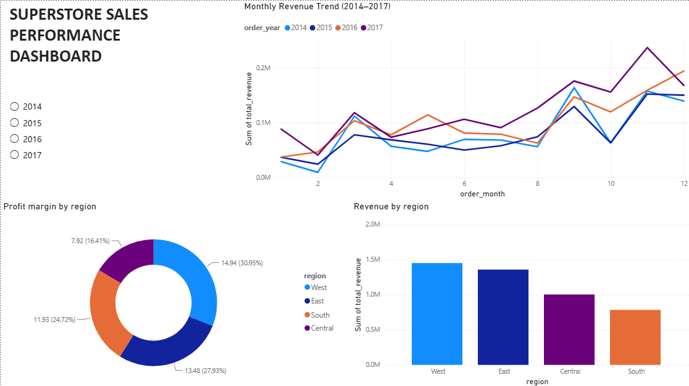
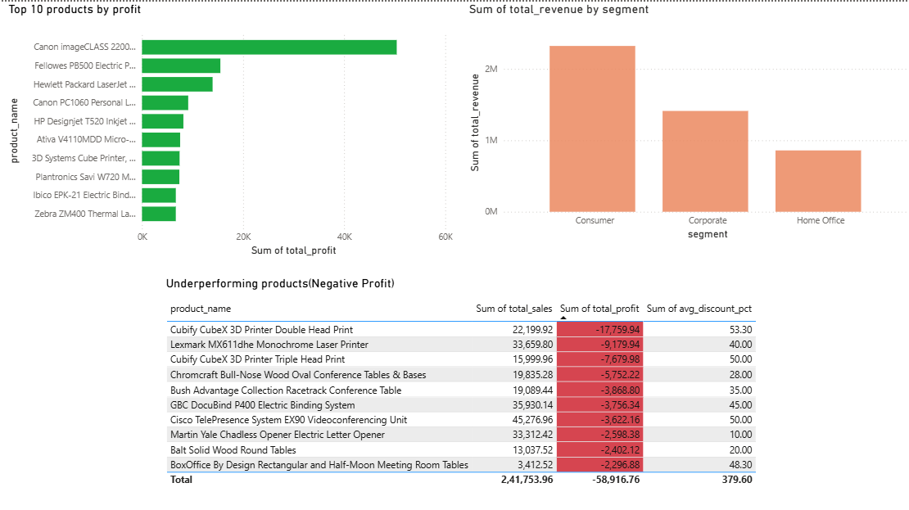
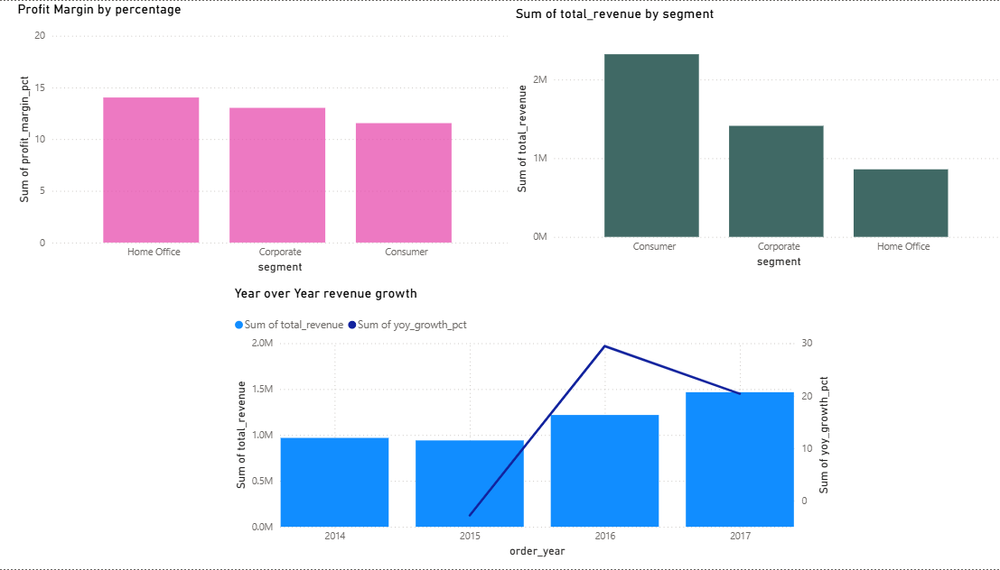
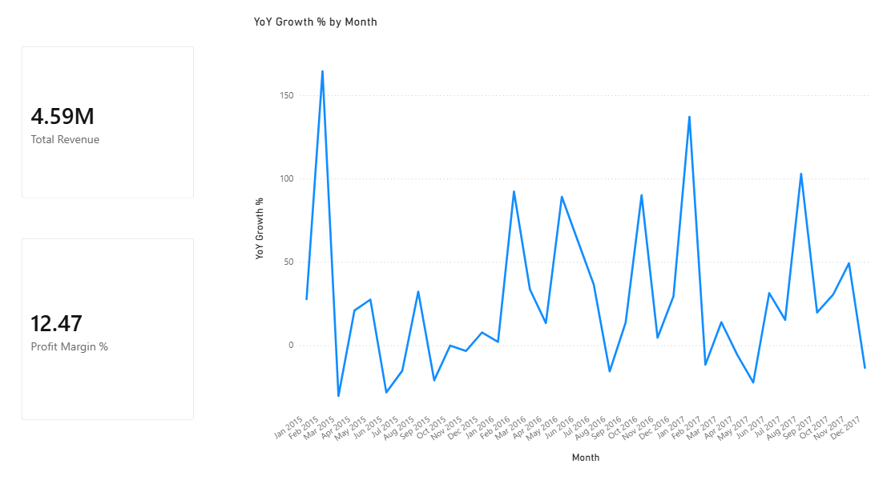

# Superstore Sales Analytics Dashboard

An end-to-end sales performance analysis of the Superstore retail dataset, built using MySQL for data cleaning and aggregation, and Power BI for visualization and DAX-based time intelligence.

## Project Overview

This project analyzes four years (2014-2017) of retail transaction data to answer core business performance questions: which regions and products drive revenue, where the business is losing money, and how growth has trended over time. The workflow mirrors a real analyst pipeline: raw data was loaded into a relational database, cleaned and aggregated using SQL, then connected to Power BI for interactive visualization and additional DAX-based calculations.

## Tools Used

- **MySQL** — data storage, cleaning, and aggregation
- **Power BI** — dashboard visualization and interactivity
- **DAX** — custom measures and time intelligence calculations
- **SQL** — window functions, CTEs, and aggregate queries

## Dataset

The Superstore dataset contains 9,984 retail transactions across four years, including order details, customer segments, product categories, regions, sales, discounts, and profit.

## Business Questions Answered

1. How does revenue trend month to month, and are there seasonal patterns?
2. Which regions generate the most revenue, and are they also the most profitable?
3. Which products are top performers by sales versus by profit?
4. Which products are actively losing the company money, and why?
5. How do customer segments compare in revenue and profit margin?
6. How has revenue grown year over year?

## SQL Analysis

All queries are in the `/sql` folder. Each file is self-contained and commented.

| File | Description |
|---|---|
| `01_monthly_revenue.sql` | Total revenue grouped by month and year |
| `02_region_performance.sql` | Revenue, profit, and profit margin by region |
| `03_top_products.sql` | Top 10 products by sales, ranked with a window function |
| `04_top_products_by_profit.sql` | Top 10 products by profit, ranked with a window function |
| `05_underperforming_products.sql` | Products with negative total profit, using `HAVING` on an aggregated value |
| `06_customer_segments.sql` | Revenue, profit, and profit margin by customer segment |
| `07_yoy_growth.sql` | Year-over-year revenue growth using a CTE and the `LAG()` window function |

## Power BI Dashboard

The dashboard is organized into four pages:

**Overview** — monthly revenue trend, revenue and profit margin by region, revenue by segment

**Products & Segments** — top products by sales and by profit side by side, an underperforming products table, and customer segment performance

**Trends** — year-over-year revenue growth, combining absolute revenue (bars) with growth rate (line) on a dual axis

**DAX Insights** — key metric cards (Total Revenue, Profit Margin %) and two DAX-driven growth charts: year-over-year and month-over-month

Screenshots of each page are in the `/screenshots` folder. The full report file is in `/powerbi`.

### Dashboard Preview

**Overview**


**Products & Segments**


**Trends**


**DAX Insights**


## DAX Measures

In addition to the SQL-based analysis, three DAX measures were built directly in Power BI to demonstrate time intelligence:

```dax
Total Revenue = SUM(orders[sales])

Profit Margin % = DIVIDE(SUM(orders[profit]), SUM(orders[sales])) * 100

YoY Growth % = 
VAR CurrentRevenue = SUM(orders[sales])
VAR PreviousYearRevenue = 
    CALCULATE(
        SUM(orders[sales]),
        SAMEPERIODLASTYEAR(DateTable[Date])
    )
RETURN
    DIVIDE(CurrentRevenue - PreviousYearRevenue, PreviousYearRevenue) * 100
```

A dedicated date table was built using `CALENDAR()` and marked as a date table to support `SAMEPERIODLASTYEAR()`, since the raw order date column had gaps and could not be used directly for time intelligence functions.

## Key Findings

- Revenue consistently peaks in November and December each year, indicating a strong holiday season effect.
- The West and East regions generate the most revenue, but profit margin does not always track revenue directly — worth comparing per region rather than assuming they move together.
- Several products with high sales volume are not among the top profit generators, and a specific set of products carry negative total profit despite meaningful sales, driven largely by high average discount rates (30-50%+). This suggests discounting policy on these items should be reviewed.
- Year-over-year revenue growth dipped slightly in 2015, accelerated sharply in 2016, and moderated somewhat in 2017, though absolute revenue continued to increase each year.

## Limitations

- Year-over-year growth cannot be calculated for 2014, since it is the first year in the dataset and has no prior year to compare against.
- The dataset covers a single retail business; findings are specific to this data and not generalized industry patterns.

## Repository Structure

```
superstore-sql-powerbi-dashboard/
  sql/
    01_monthly_revenue.sql
    02_region_performance.sql
    03_top_products.sql
    04_top_products_by_profit.sql
    05_underperforming_products.sql
    06_customer_segments.sql
    07_yoy_growth.sql
  powerbi/
    superstore_dashboard.pbix
  screenshots/
    overview.png
    products_segments.png
    trends.png
    dax_insights.png
  README.md
```
